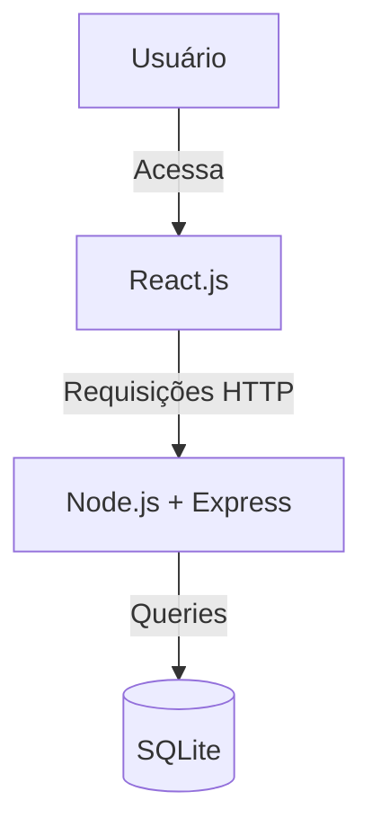

# ⚽ PassaPraEla


---

## 📖 Descrição do Projeto

**PassaPraEla** é uma plataforma web focada no **futebol feminino amador**, que visa aumentar a visibilidade das jogadoras, centralizar informações (perfil das atletas, notícias e jogos) e promover a interação entre a comunidade.

O projeto foi desenvolvido como parte de um desafio acadêmico e demonstra competências em desenvolvimento **full‑stack**, deploy e integração entre frontend e backend.

---

## 👩‍💻 Equipe — Veltrix

* **Gabriel Akira** — RM: 565191
* **Gustavo Santos** — RM: 561820
* **Mauro Carlos** — RM: 556645
* **Ana Luiza Tibiriçá** — RM: 562098

---

## 📸 Screenshots

### Tela Inicial


### Página de Jogadoras


---

## 🌐 Links

* **Frontend (Vercel):** [https://passa-pra-ela-oficial.vercel.app/](https://passa-pra-ela-oficial.vercel.app/)
* **Backend (Render):** [https://backendpassapraela.onrender.com](https://backendpassapraela.onrender.com)
* **Repositório GitHub:** [https://github.com/EnoTech-CP1-FRONT/PassaPraEla](https://github.com/EnoTech-CP1-FRONT/PassaPraEla)

---

## 📁 Estrutura do Repositório (exemplo)

```
PassaPraEla/
├─ backend/
│  ├─ src/
│  ├─ package.json
│  └─ database.sqlite
├─ frontend/
│  ├─ src/
│  ├─ package.json
│  └─ vite.config.js
└─ README.md
```

> Ajuste conforme a organização real do seu repositório.

---

## ⚙️ Tecnologias Utilizadas

**Frontend**

* React (Vite)
* Tailwind CSS
* Axios

**Backend**

* Node.js
* Express
* SQLite

**Deploy**

* Vercel (frontend)
* Render (backend)

---

## 🏗️ Arquitetura do Projeto

A aplicação segue a separação clássica:

* **Frontend** (cliente): interface, chamadas HTTP, rotas, visualização.
* **Backend** (API): autenticação, CRUD, persistência em SQLite.



---

## 🚀 Funcionalidades

* Cadastro de usuários (POST /cadastrar)
* Login de usuários (POST /login)
* Listagem de jogadoras (GET /jogadoras)
* Exibição de notícias (apenas em ambiente de desenvolvimento/teste)
* Deploy em produção (frontend + backend)

---

## 🔮 Roadmap / Futuras Melhorias

* Integração com APIs oficiais de campeonatos (ex.: Brasileirão Feminino)
* Painel administrativo para gerenciar jogadoras e notícias
* Área de comunidade (mensagens, eventos, recrutamento)
* Favoritos / seguir jogadoras e times
* Autenticação com OAuth (Google / Facebook)
* Tests automatizados (unit / e2e)

---

## 🛠️ Como Rodar o Projeto Localmente

> **Pré‑requisitos:** Node.js, npm (ou yarn)

### Backend

```bash
# Clone o repositório (se ainda não tiver)
git clone https://github.com/EnoTech-CP1-FRONT/PassaPraEla.git

# Entre no diretório do backend
cd PassaPraEla/backend

# Instale as dependências
npm install

# Inicie o servidor
npm start
```

O backend deverá ficar disponível em `http://localhost:3001` (verifique a porta no `package.json`/`index.js`).

### Frontend

```bash
# Em um novo terminal, acesse o frontend
cd PassaPraEla/frontend

# Instale as dependências
npm install

# Rode a aplicação em modo de desenvolvimento
npm run dev
```

O frontend normalmente estará disponível em `http://localhost:5173` (ou porta definida pelo Vite).

---

## 📡 Endpoints Principais (exemplos)

**Cadastrar usuário**

* `POST /cadastrar`
* Body (JSON):

```json
{
  "nome": "Seu Nome",
  "email": "seu@email.com",
  "senha": "sua-senha"
}
```

**Login**

* `POST /login`
* Body (JSON):

```json
{
  "email": "seu@email.com",
  "senha": "sua-senha"
}
```

**Listar jogadoras**

* `GET /jogadoras`
* Retorna um array de objetos:

```json
[
  {
    "id": 1,
    "nome": "Letícia Izidoro",
    "numero_camisa": 10,
    "posicao": "Atacante",
    "url_imagem": "https://..."
  }
]
```

> ⚠️ Observação: a API de notícias funciona apenas em ambiente de testes locais — para produção pode ser necessário um plano pago da fonte das notícias.

---

## 🗄️ Exemplo: Estrutura da tabela `jogadoras` (SQLite)

```sql
CREATE TABLE jogadoras (
  id INTEGER PRIMARY KEY AUTOINCREMENT,
  nome TEXT NOT NULL,
  numero_camisa INTEGER NOT NULL,
  posicao TEXT NOT NULL,
  url_imagem TEXT
);

INSERT INTO jogadoras (nome, numero_camisa, posicao, url_imagem) VALUES
('Letícia Izidoro', 10, 'Atacante', 'https://exemplo.com/leticia.jpg');
```

---

## 🧰 Dicas Úteis / Troubleshooting

### Erro ao dar `git pull`/`git push` (ex.: non-fast-forward)

Se o Git reclamar que você tem alterações locais que seriam sobrescritas:

```bash
# Salve alterações locais temporariamente
git stash

# Sincronize com o remoto
git pull origin main

# Recupere seu trabalho local
git stash pop
```

Se ocorrer conflito, resolva arquivos conflitantes manualmente, depois:

```bash
git add <arquivos-resolvidos>
git commit -m "Resolve conflitos"
git push origin main
```

### Problema com dependências / `npm install` travando

* Feche editores/IDEs que possam travar arquivos (OneDrive/Windows Explorer às vezes bloqueiam arquivos).
* Execute `npm cache clean --force` e tente novamente.
* Remova `node_modules` e `package-lock.json` e rode `npm install` de novo:

```bash
rm -rf node_modules package-lock.json
npm install
```

---

## 🤝 Como Contribuir

1. Faça um fork do projeto
2. Crie uma branch: `git checkout -b minha-feature`
3. Faça commits claros e pequenos: `git commit -m "feat: descrição curta"`
4. Envie para o seu fork: `git push origin minha-feature`
5. Abra um Pull Request descrevendo a mudança

Se quiser ajudar com issues abertas, crie uma branch específica para cada tarefa.

---

## 📞 Contato

* Gabriel Akira — [gabriel@example.com](mailto:gabriel@example.com) (substitua pelo e‑mail real)
* Para dúvidas sobre o deploy, verifique os logs no Render (backend) e Vercel (frontend).

---

## 📄 Licença

Todos os direitos reservados © 2025 - Equipe Veltrix.  
Este projeto não pode ser utilizado, modificado ou distribuído sem autorização prévia.

---

## 🖼️ Sugestões para o README (opcionais)

* Adicionar screenshots do frontend (colocar na pasta `assets/` e referenciar)
* Banner/Logo no topo (imagem gerada ou ASCII art)
* Badges de workflow/CI (se adicionarem GitHub Actions)

---


